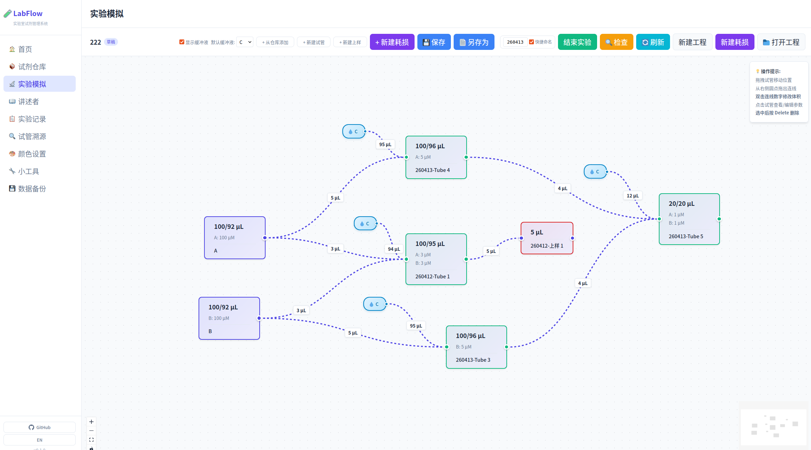
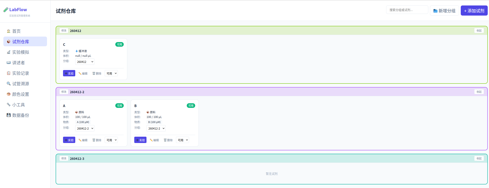
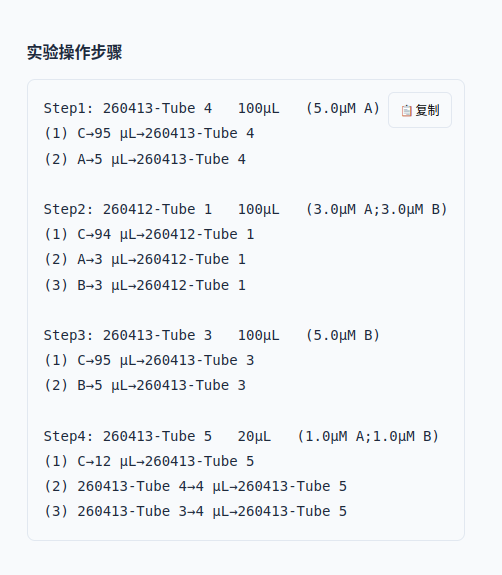
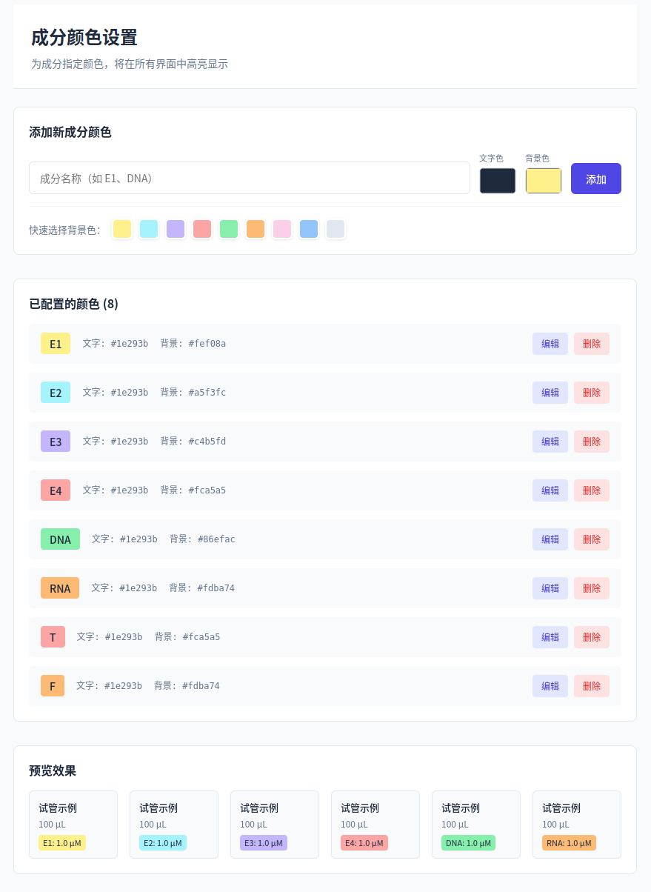
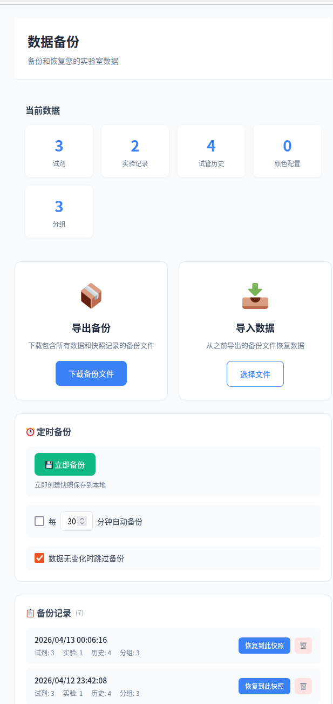

# LabFlow

> A visual laboratory reagent management and experiment workflow simulator — making experiment design more intuitive and efficient

## 🆕 What's New in v0.2.0

- 🏠 **Brand New Home Page**: Clock, search, daily quotes — a welcoming start every time
- 🧰 **Utility Tools**: Nucleic acid chain calculator (sequence length ↔ molecular weight conversion)
- 📦 **Tube Grouping**: Group reagents by batch, with collapse and search-to-locate support
- 🎙️ **Narrator**: Automatically converts flowcharts into copyable SOP text steps
- 🎨 **Component Color Config**: Custom text and background colors for each component on tube labels
- 💾 **Data Backup**: Scheduled auto-backup + snapshot restore + JSON export/import
- 🌗 **Dark / Light Theme** + **Font Size Adjustment** (12–20 px)
- 🔧 **Refresh Button**: Reload raw material data and recalculate all intermediate products
- 🐛 **Fixes**: Experiment revert / completion state persistence

---



## 🚀 Quick Start

### Windows (Recommended)

1. **Download the installer**
   👉 [Download LabFlow-Installer.bat](https://raw.githubusercontent.com/Luminave/LabFlow/main/LabFlow-Installer.bat)

2. **Run the installer**
   - Right-click `LabFlow-Installer.bat`
   - Select **"Run as administrator"**
   - Follow the prompts (Git & Node.js are installed automatically if needed)

3. **Launch LabFlow**
   - A `Start-LabFlow` shortcut will appear on your desktop — double-click to launch
   - Your browser opens http://localhost:5173/ automatically

### Linux / macOS

```bash
git clone https://github.com/Luminave/LabFlow.git
cd LabFlow
npm install
npm run dev
# Visit http://localhost:5173/
```

---

## Features

### 📦 Reagent Warehouse



- **CRUD Operations**: Add, edit, delete reagents. Track name, volume, concentration, storage location
- **Tube Grouping**: Auto-named by batch (e.g. `260412`), 12 preset colors randomly assigned
  - Groups can be collapsed / expanded with persistent state
  - Search bar supports searching by reagent or group name, with auto-locate and highlight flash
  - Ungrouped reagents displayed outside group boxes
- **Group Management**: Edit name, color (8 presets + custom palette), and notes
- **Status Management**: Available / Low / Deprecated — switch directly on reagent cards

### 🔬 Experiment Simulation

- **Visual Flowchart**: Drag-and-drop tube nodes, connect with liquid transfer lines
- **Add from Warehouse**: Click to add warehouse reagents to your experiment
- **Create Tubes / Load Samples**: Create intermediate product nodes
- **Volume Editing**: Click the number on a connection line to modify transfer volume
- **Auto Concentration Calculation**: Target tube concentration and total volume updated in real-time
- **Check Function**: One-click validation of all tube concentrations and volumes, results in the right panel
- **Consumption / Raw Material**: Mark reagents as consumed or designate as raw materials
- **Experiment Timer**: Track time spent on each step
- **Refresh Button**: Reload raw material data and recalculate all intermediate products

### 🎙️ Narrator (SOP Generator)



- **Auto-generate SOP**: Converts flowcharts into linear text steps
- **Config Order**: Assign `configOrder` to tubes, narrator follows the sequence
- **One-click Copy**: Copy button on each step for easy pasting into lab notebooks or papers
- **Sorted by Volume**: Steps sorted by transfer volume (largest first), major components shown first

### 🎨 Component Color Configuration



- **Custom Colors**: Set text and background colors for each component (e.g. DNA, RNA, protein)
- **Quick Presets**: 9-color palette for one-click application
- **Live Preview**: Tube model cards at the bottom show how colors render in the actual UI
- **HEX Values**: Precise #RRGGBB for publication-quality figures

### 💾 Data Backup



- **Data Overview**: At-a-glance statistics — reagent count, experiment records, tube history, group count
- **Scheduled Auto-backup**: Default every 30 minutes, customizable interval
- **Skip When Unchanged**: Automatically skips backup if no data changes detected
- **Snapshot Restore**: Browse backup history, click "Restore to this snapshot" to roll back
- **Export / Import**: Export as JSON file, import to restore

### 📋 Experiment Records

- **Auto-save History**: Each experiment is saved automatically when completed
- **View Details**: Review the final state of every tube in an experiment
- **Revert Experiment**: Roll back warehouse state to before the experiment

### 🔍 Tube Traceability

- Unique ID assigned to each tube (e.g. `260413-Tube 4`)
- Track tube origin and destination
- Record which experiments used each tube

### ⚙️ More

- 🌗 **Dark / Light theme toggle**
- 🔤 **Font size adjustment**: 12 – 20 px, adapts to different screens and visual needs
- 🌐 **Chinese / English language switch**

---

## Tech Stack

| Technology | Purpose |
|------------|---------|
| **React 18** + **TypeScript** | Frontend framework |
| **React Flow** (`@xyflow/react`) | Flowchart visualization |
| **Zustand** | State management |
| **sql.js** (SQLite) | Local data storage |
| **Vite** | Build tool & dev server |
| **react-router-dom** | Routing |
| **date-fns** | Date utilities |

---

## Project Structure

```
LabFlow/
├── src/
│   ├── renderer/              # Renderer process (React app)
│   │   ├── components/
│   │   │   ├── Layout.tsx     # Layout (nav bar + version)
│   │   │   └── TransferEdge.tsx  # Custom transfer edge
│   │   ├── pages/
│   │   │   ├── HomePage.tsx       # Home
│   │   │   ├── WarehousePage.tsx  # Reagent warehouse
│   │   │   ├── ExperimentPage.tsx # Experiment simulation
│   │   │   ├── RecordPage.tsx     # Experiment records
│   │   │   ├── NarratorPage.tsx   # Narrator
│   │   │   ├── BackupPage.tsx     # Data backup
│   │   │   └── ToolsPage.tsx      # Utility tools
│   │   ├── stores/            # Zustand state management
│   │   ├── i18n/              # Internationalization
│   │   └── styles/            # CSS Module styles
│   └── shared/
│       ├── types/             # TypeScript type definitions
│       └── utils/             # Utilities (database, backup, etc.)
├── vite.config.browser.ts     # Browser-mode Vite config
├── LabFlow-Installer.bat      # Windows one-click installer
├── Start-LabFlow.bat          # Windows launch script
└── screenshots/               # README screenshots
```

---

## Development

### Browser Mode (Recommended)

```bash
npm install
npm run dev
# Visit http://localhost:5173/
```

### Electron Desktop Mode (Experimental)

```bash
npm install
npm run electron:dev
```

> ⚠️ Electron mode may require additional configuration. Browser mode is recommended.

---

## Troubleshooting

### Windows

| Issue | Solution |
|-------|----------|
| Installer requires admin | Right-click → Run as administrator |
| Git / Node.js download slow | Wait patiently, or install manually and re-run |
| Browser doesn't open | Visit http://localhost:5173/ manually |
| `npm not recognized` | Install Node.js, then restart terminal |

### Linux

```bash
# Port 5173 is in use
lsof -i :5173
kill -9 <PID>
```

---

## License

MIT
